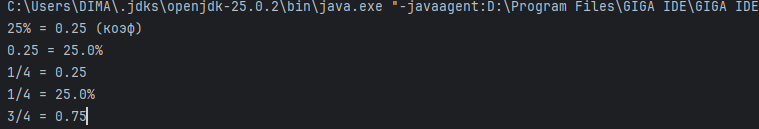
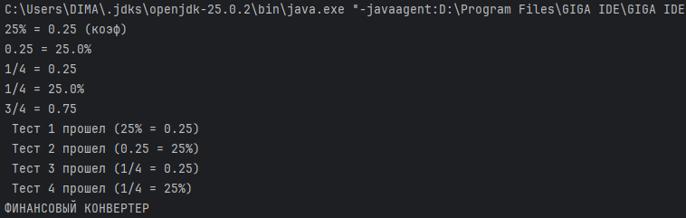
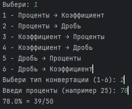
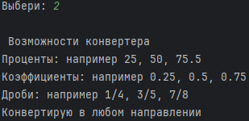

Вариант 5

Ход выполнения работы:

В ходе выполнения лабораторной работы был разработан финансовый конвертер, позволяющий преобразовывать значения между процентами, коэффициентами и дробями. Данный выбор обусловлен пятым вариантом задания, где требуется работа с процентными ставками, десятичными коэффициентами и простыми дробями.
Проект реализован с соблюдением архитектуры MVC (Model-View-Controller). На первом этапе была создана модель (класс Model), в которой реализована вся математическая логика конвертации. В модели хранятся методы для преобразования процентов в коэффициенты, процентов в дроби, коэффициентов в проценты, коэффициентов в дроби, дробей в проценты и дробей в коэффициенты. Также в модель включены вспомогательные методы для сокращения дробей и проверки корректности ввода.
На втором этапе был разработан контроллер (класс Control), который отвечает за взаимодействие с пользователем. Контроллер содержит меню с выбором действий, обрабатывает пользовательский ввод, вызывает соответствующие методы модели и выводит результаты. В контроллере реализована обработка исключительных ситуаций: проверка на пустой ввод, проверка корректности введенных чисел, проверка формата дробей.
Третьим этапом стала реализация представления (View). В качестве представления выступает консольный интерфейс, поскольку разработка велась в среде GigaIDE без использования JavaFX. Пользователю выводится понятное меню с вариантами конвертации, приглашения ко вводу и сообщения об ошибках.
В процессе разработки проводилось тестирование всех шести направлений конвертации. Были проверены следующие сценарии: перевод 25% в коэффициент (ожидаемый результат 0.25), перевод 0.25 в проценты (ожидаемый результат 25%), перевод 1/4 в коэффициент (ожидаемый результат 0.25), перевод 1/4 в проценты (ожидаемый результат 25%), перевод 3/4 в коэффициент (ожидаемый результат 0.75). Результаты тестирования представлены на рисунке 1. 

**Рисунок 1 – Тестирование конвертера (часть 1)**

Как видно из рисунка 1, все тесты успешно пройдены, программа корректно выполняет необходимые преобразования. На рисунке 2 представлен интерфейс программы в процессе работы. Пользователю доступно меню с тремя пунктами: конвертация, справка о возможностях программы и выход. При выборе конвертации открывается подменю с шестью вариантами преобразований, что обеспечивает удобство использования.
 

**Рисунок 2 – Тестирование конвертера (часть 2)**

В качестве дополнительной опции (индивидуальности) была добавлена возможность сокращения дробей. Например, при вводе 50% программа выдает не 50/100, а сокращенную дробь 1/2. Также реализована защита от некорректного ввода: при попытке ввести текст вместо числа или дробь в неверном формате программа выводит соответствующее сообщение и предлагает повторить ввод. На рисунке 3 продемонстрируем конкретные вычисления и возможности конвертера для данной предметной области. 

**Рисунок 3 – Конвертирование данных**

В завершении программы пользователь может выбрать пункт 2 и узнать общие возможности конвертера. Результат показан на рисунке 4.

 

**Рисунок 4 – Возможности конвертера**
